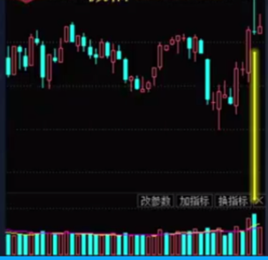
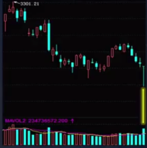

供需关系
趋势的动力来自于供需关系的不平衡；
力量与质量

因果关系
趋势形成之前需要准备过程
过程、时空

### 努力与结果
成交量的增长没有使价格大幅增长，这是走势停止行为
显性和隐性

典型的停止行为（一）：努力与结果的不匹配
放量的长 上影线/下影线

随着成交量的放大，需求的努力，没有取得相应的结果（价格没有进一步上涨）
==》 有新增的供应入场，后续会如何发展呢？
三种可能：
（1）短暂整理后，价格继续上涨【暂时供应，散户在供应】
（2）震荡整理，价格下跌（主力开始派发了）
（3）不经过任何整理，直接下跌（不计成本，直接抛售）

随着成交量的放大，供应的努力，没有取得相应的结果（价格没有进一步下跌）
==》 有新增的需求入场，
三种可能：
（1）短暂整理后，价格继续下跌【暂时供应】
（2）震荡整理，价格上涨（主力开始派发了）
（3）不经过任何整理，直接上涨（不计成本，直接抛售）

tick数据
明确一个行情数据接收和处理的概念

压力支撑

均线？
筹码分布？ 
关键价位

压力
·某个价位抛售力量超过了购买力供应超过了需求 
当价格再次回到压力位价格回落力度表明供应是否扩大

支撑
在某个价位购买力超过了抛售压力需求吸收了全部供应
当价格再次回到支撑位反弹力度表明需求质量

量 供应和需求投入的兵力

价 供应和需求当前的强弱

时 供应和需求拉锯的过程长度

空 供应和需求战场的广阔程度

你围绕什么做交易？你交易的是你的观点，而不是市场

量价时空是你的全部观察（变量）吗？

如果不是，还需要什么？

### 集合竞价

集合竞价，是指每天开盘前，交易所主机接受入市者申报的买卖指令按价格优先和时间优先的原则计算
各价位的成交量，最后以最大成交 量的价格作为集合竞价的成交价 这个集合竞价的成交价就是该股的
开盘价；而这个过程就被称为集合 竞价 集合竞价期间（09：15-09：30）各个时间段的动作和限制见左图。

### 除权/复权

### 打新

